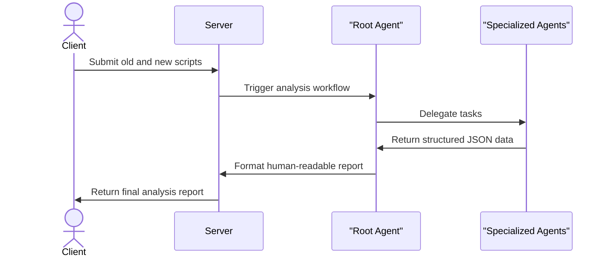

# ScriptSculpt

ScriptSculpt helps production teams and developers automate the analysis of screenplay revisions. It takes two versions of a script, identifies exact line changes, and determines which production departments need to know about them. Teams get clear reports on sound continuity risks, prop changes, and lighting shifts without having to manually read every page.

## System Architecture


## Features

* **Script Version Comparison**: Accurately compares two script inputs to detect insertions, deletions, and modifications down to the line level.
* **Department Impact Classification**: Analyzes changes to figure out if departments like camera, lighting, makeup, or visual effects need to take action.
* **Sound Continuity Analysis**: Scans for dialogue adjustments and background noise changes to ensure audio production remains consistent across scenes.



## Installation

Follow these steps to get the environment running on your local machine.

Clone the repository:
```bash
git clone https://github.com/Ace-g-ops/substrxx
cd substrxx
```

Install the dependencies:
```bash
pip install -r multi_tool_agent/requirements.txt
```

Alternatively, you can build and run the project using Docker:
```bash
docker build -t scriptsculpt .
docker run -p 8080:8080 scriptsculpt
```

## Usage

Start the backend server using Uvicorn or the provided startup script.

```bash
cd multi_tool_agent
python server.py
```

The server will initialize the AI agents and mount the web interface on `http://0.0.0.0:8000`. You can pass the contents of an old script and a revised script to the agent system, which will output a structured analysis report containing the line changes and departmental impact.

## API Documentation

The server exposes the agent functionality via FastAPI. Below is the expected interaction payload structure for the core agent endpoint.

#### POST /invoke
**Description**: Triggers the Root Agent to analyze the screenplay differences and generate a comprehensive impact report.

**Request**:
```json
{
  "old_script": "INT. BEDROOM - DAY\nMAYA speaks normally.",
  "new_script": "EXT. ROADSIDE - NIGHT\nMAYA whispers to him."
}
```

**Response**:
```json
{
  "status": "success",
  "data": {
    "comparison": {
      "status": "success",
      "total_changes": 2,
      "changes": [
        {
          "change_type": "replace",
          "old_lines": ["INT. BEDROOM - DAY"],
          "new_lines": ["EXT. ROADSIDE - NIGHT"],
          "old_line_range": [1, 1],
          "new_line_range": [1, 1]
        }
      ]
    },
    "department_impact": {
      "departments": [
        {
          "department": "lighting",
          "evidence": "EXT. ROADSIDE - NIGHT",
          "justification": "Scene changed from day to night.",
          "reasoning": "Lighting department must prepare for a night shoot."
        }
      ]
    },
    "sound_continuity": {
      "risks": [
        {
          "scene_or_location": "EXT. ROADSIDE - NIGHT",
          "evidence": "MAYA whispers to him.",
          "requirement_or_risk": "Actor is whispering in an outdoor environment.",
          "recommended_action": "Ensure lavalier mics are prepped for low volume dialogue.",
          "confidence": "fact"
        }
      ],
      "summary": "Audio continuity impacted by new whispered dialogue and outdoor setting."
    }
  }
}
```

**Errors**:
* 400: Both screenplay versions must be text.
* 400: Both screenplay versions are required.
* 500: The screenplay comparison failed.

**Environment Variables**:
* `GEMINI_API_KEY`: Required by the Google ADK to communicate with the `gemini-3.6-flash` model.

## Technologies Used

| Technology | Purpose |
| :--- | :--- |
| Python 3.11 | Core programming language |
| FastAPI | Web framework for the API |
| Google ADK | Agent development and orchestration |
| Pydantic | Data validation and JSON schema |
| Docker | Containerization |

## Contributing

Contributions are welcome. Please ensure that you update tests as appropriate when adding new features or fixing bugs. Create a feature branch for your changes and submit a pull request for review.

## Author Info

* GitHub: [Ace-g-ops](https://github.com/Ace-g-ops)

---

[](https://www.python.org/)
[](https://fastapi.tiangolo.com/)
[](https://www.docker.com/)